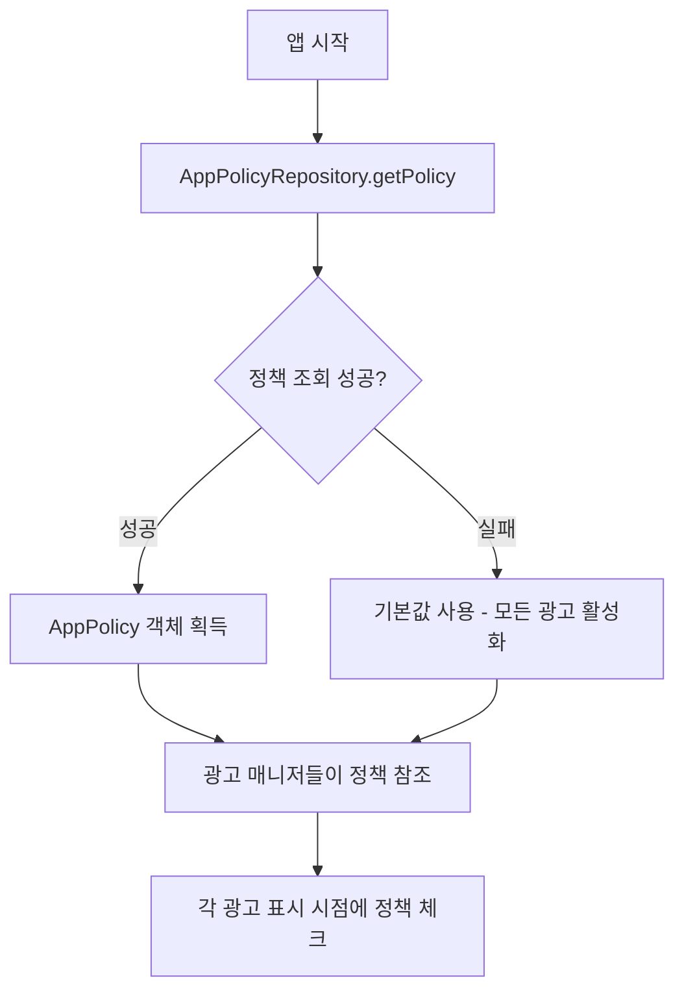

# AdMob 광고 Supabase 제어 계획안

## 📋 개요

현재 Supabase로 팝업을 관리하는 것처럼, AdMob 광고의 on/off도 Supabase를 통해 실시간으로 제어할 수 있도록 구조를 설계합니다.

---

## 🎯 목표

1. **실시간 제어**: Supabase 대시보드에서 광고를 즉시 on/off 가능
2. **광고 타입별 세밀한 제어**: App Open, Interstitial, Banner 각각 독립적으로 제어
3. **기존 구조 활용**: 현재 AppPolicy 모델을 확장하여 일관성 유지
4. **안전한 fallback**: 정책 조회 실패 시 기본 동작 보장

---

## 📊 현재 구조 분석

### 1. 광고 타입

| 광고 타입 | 설명 | 관리 클래스 | 현재 제어 방식 |
|---------|------|-----------|--------------|
| **App Open Ad** | 앱 시작/복귀 시 표시 | `AppOpenAdManager.kt` | 항상 활성화 (ON/OFF 불가) |
| **Interstitial Ad** | 화면 전환 시 전면 광고 | `InterstitialAdManager.kt` | 항상 활성화 (ON/OFF 불가) |
| **Banner Ad** | 상단 배너 광고 | `MainActivity.kt` | SharedPreferences (앱 내부에서만 제어) |

**현재 문제점:**
- App Open / Interstitial: 코드에 ON/OFF 로직 자체가 없음 → 끌 수 없음
- Banner: 앱 내부(디버그 화면)에서만 제어 가능 → 외부에서 실시간 제어 불가능
- **목표: Supabase 대시보드에서 3가지 광고 모두 실시간 ON/OFF 제어**

### 3. Google AdMob 정책 준수 검토

#### ✅ App Open Ad (앱 오픈 광고)

**현재 구현:**
```kotlin
- 광고 유효 시간: 4시간 (권장: 4시간)
- 첫 실행 시: 광고 표시 안 함 (콜드 스타트)
- 백그라운드 복귀 시: 광고 표시 (웜 스타트)
```

**Google 정책 준수 여부:**
| 항목 | Google 권장사항 | 현재 구현 | 상태 |
|-----|---------------|---------|------|
| 광고 유효 시간 | 4시간 이내 | ✅ 4시간 (`AD_TIMEOUT_MS = 4 * 60 * 60 * 1000L`) | ✅ 준수 |
| 첫 실행 제한 | 콜드 스타트 시 광고 표시 자제 권장 | ✅ `isFirstLaunch` 체크 | ✅ 준수 |
| 로딩 시점 | 앱 시작 시 미리 로드 | ✅ `init` 블록에서 로드 | ✅ 준수 |
| 중복 표시 방지 | 광고 표시 중 추가 광고 차단 | ✅ `isShowingAd` 플래그 | ✅ 준수 |

**결론:** ✅ **AdMob 정책 완벽 준수**

---

#### ⚠️ Interstitial Ad (전면 광고)

**현재 구현:**
```kotlin
- 광고 노출 간격: 60초 (1분)
- 최소 화면 전환: 3회
- 자동 재로드: 광고 닫힌 후 즉시
```

**Google 정책 준수 여부:**
| 항목 | Google 권장사항 | 현재 구현 | 상태 |
|-----|---------------|---------|------|
| 최소 노출 간격 | **최소 30초 이상** 권장 | ✅ 60초 (`AD_INTERVAL_SECONDS = 60`) | ✅ 준수 |
| 화면 전환 기준 | 자연스러운 전환 지점 | ✅ 화면 전환 3회 후 (`MIN_SCREEN_TRANSITIONS = 3`) | ✅ 준수 |
| 중복 로드 방지 | 광고 로드 중 재요청 차단 | ✅ `isLoading` 플래그 | ✅ 준수 |
| 프리로딩 | 표시 전 미리 로드 | ✅ `init` 블록 + 자동 재로드 | ✅ 준수 |

**⚠️ 개선 권장사항:**
1. **노출 빈도 제한 추가**
   - Google은 과도한 광고 노출을 금지
   - 현재: 60초마다 무제한 표시 가능
   - 권장: **시간당 최대 2-3회, 하루 최대 20-30회** 제한 추가

2. **사용자 행동 기반 제한**
   - 짧은 시간에 여러 번 화면 전환 시 광고 폭격 가능성
   - 권장: 일정 시간 내 최대 표시 횟수 제한

**결론:** ✅ **기본 정책은 준수하나, 빈도 제한 강화 권장**

---

#### ✅ Banner Ad (배너 광고)

**현재 구현:**
```kotlin
- 위치: 상단 고정
- 크기: BANNER (320x50)
- 자동 갱신: AdMob 기본 설정 (60초)
```

**Google 정책 준수 여부:**
| 항목 | Google 권장사항 | 현재 구현 | 상태 |
|-----|---------------|---------|------|
| 배너 위치 | 상단 또는 하단 고정 | ✅ 상단 고정 | ✅ 준수 |
| 배너 크기 | 표준 크기 사용 | ✅ BANNER (320x50) | ✅ 준수 |
| 콘텐츠 겹침 | 콘텐츠와 겹치지 않기 | ✅ 별도 영역 할당 | ✅ 준수 |
| 화면당 개수 | 화면당 1개 배너만 | ✅ 1개만 표시 | ✅ 준수 |

**결론:** ✅ **AdMob 정책 완벽 준수**

---

### 4. 종합 평가 및 권장 사항

#### ✅ 현재 구현 종합 평가

| 광고 타입 | 정책 준수도 | 개선 필요도 | 비고 |
|---------|-----------|-----------|------|
| App Open Ad | ⭐⭐⭐⭐⭐ (완벽) | 없음 | 모든 정책 준수 |
| Interstitial Ad | ⭐⭐⭐⭐ (양호) | ⚠️ 빈도 제한 권장 | 기본 정책 준수, 추가 제한 필요 |
| Banner Ad | ⭐⭐⭐⭐⭐ (완벽) | 없음 | 모든 정책 준수 |

#### 💡 빈도 제한이란? (쉬운 설명)

**빈도 제한 = "광고를 시간당/하루에 몇 번까지만 보여줄지 제한하는 것"**

**🍕 피자 가게로 비유:**

현재 상황 (빈도 제한 없음):
```
손님이 가게에 들어올 때마다 "피자 광고 전단지" 강제로 보여주기
- 손님이 1분에 10번 왔다갔다 하면? → 10번 광고 보여줌
- 하루종일 100번 왔다갔다? → 100번 광고 보여줌
→ 손님: "이 가게 광고 너무 많아! 다시는 안 와!" 😡
```

빈도 제한 추가 후:
```
손님이 아무리 자주 와도 "1시간에 최대 3번만" 광고 보여주기
- 손님이 1분에 10번 왔다갔다 해도 → 3번만 광고
- 하루 100번 왔다갔다 해도 → 최대 20번만 광고
→ 손님: "가끔 광고 나오네, 뭐 괜찮아" 😊
```

**❓ 왜 필요한가?**

현재 설정 (60초 간격 + 3회 화면 전환):
- 10:00 - 홈→코드→홈→메트로놈→홈 (광고 1회) ✅
- 10:02 - 홈→튜너→홈→코드→홈 (광고 2회) ✅
- 10:04 - 홈→설정→홈→코드→홈 (광고 3회) ✅
- ... 30분 동안 15번 광고! 😱

문제점:
- ❌ 사용자가 앱을 많이 사용할수록 광고도 무한정 증가
- ❌ 사용자 짜증 → 앱 삭제
- ❌ Google이 "과도한 광고"로 판단 → 계정 정지 위험

**✅ 빈도 제한의 장점:**

1. **사용자 경험 보호**
   - 많이 써도 광고는 제한적 → 사용자 만족
   
2. **장기 수익 증가**
   - 단기: 광고 많이 → 사용자 이탈 → 수익 0원 ❌
   - 장기: 광고 적당히 → 사용자 유지 → 수익 계속 ✅
   
3. **Google 정책 준수**
   - 과도한 광고 → 계정 정지 위험 ❌
   - 적당한 광고 → 계정 안전 ✅

**🎮 실제 운영 예시:**

일반 사용자 (하루 20분 사용):
- 빈도 제한 없음: 광고 10번 → ⭐⭐ (2점 리뷰)
- 빈도 제한 있음: 광고 3번 → ⭐⭐⭐⭐ (4점 리뷰)

파워 유저 (하루 2시간 사용):
- 빈도 제한 없음: 광고 60번 😱 → 앱 삭제
- 빈도 제한 있음: 광고 20번 → 계속 사용

**🎯 코드 vs Supabase 제어:**

코드에 하드코딩 (나쁨):
```kotlin
private const val MAX_ADS_PER_HOUR = 3  
// 바꾸려면 앱 업데이트 + 심사 대기 (1주일) 😢
```

Supabase 제어 (좋음):
```sql
UPDATE app_policy SET ad_interstitial_max_per_hour = 2;
-- 5초만에 즉시 변경! 😊
```

**📊 운영 전략:**

Phase 1: 보수적으로 시작
```sql
-- 광고 적게 보여주고 사용자 반응 보기
ad_interstitial_max_per_hour = 2
ad_interstitial_max_per_day = 15
```

Phase 2: 데이터 기반 조정
```sql
-- 사용자 이탈 없으면 조금 늘리기
UPDATE app_policy SET ad_interstitial_max_per_hour = 3;

-- 불만 많으면 줄이기
UPDATE app_policy SET ad_interstitial_max_per_hour = 1;

-- 특별 이벤트 기간에는 광고 끄기
UPDATE app_policy SET ad_interstitial_enabled = false;
```

**상황별 대응:**

케이스 1: 앱 평점 하락
```
리뷰: "광고 너무 많아요 😡"
→ Supabase에서 즉시 빈도 줄이기 (20회 → 10회)
```

케이스 2: 명절 이벤트
```
추석/크리스마스
→ Supabase에서 광고 완전히 끄기
→ 사용자 좋은 경험 → 평점 상승
```

케이스 3: 수익 필요 시
```
→ 조금 늘리기 (15회 → 20회)
→ 평점 모니터링
```

**한 줄 요약:**
"광고를 너무 많이 안 보여주려고 제한하는 건데, Supabase로 하면 상황에 따라 실시간으로 조절할 수 있어서 좋다!"

---

#### 📋 개선 권장 사항

**1. Interstitial Ad 빈도 제한 추가 (선택사항 - 강력 권장)**

```kotlin
// 시간당 최대 노출 횟수
private const val MAX_ADS_PER_HOUR = 3

// 하루 최대 노출 횟수
private const val MAX_ADS_PER_DAY = 20

// SharedPreferences에 저장
- "ad_count_hourly" : Int (매 시간 초기화)
- "ad_count_daily" : Int (매일 자정 초기화)
- "last_hour_reset" : Long
- "last_day_reset" : Long
```

**2. Supabase 정책에 빈도 제어 추가 (향후 확장)**

```sql
-- app_policy 테이블에 추가 가능한 컬럼
ALTER TABLE app_policy
ADD COLUMN ad_interstitial_max_per_hour INT DEFAULT 3,
ADD COLUMN ad_interstitial_max_per_day INT DEFAULT 20;
```

#### ⚠️ 주의: 과도한 광고 노출의 위험

Google AdMob 정책 위반 시:
1. **광고 수익 감소** - 사용자 이탈로 인한 노출 감소
2. **앱 평점 하락** - 과도한 광고에 대한 부정적 리뷰
3. **AdMob 계정 정지 위험** - 정책 위반 누적 시 계정 정지 가능
4. **Google Play 정책 위반** - 사용자 경험 저해로 앱 삭제 위험

#### ✅ 결론

**현재 구현은 Google AdMob의 기본 정책을 모두 준수하고 있습니다.**

단, Interstitial Ad의 경우 **시간당/일일 노출 제한을 추가**하는 것을 권장합니다. 이는:
- AdMob 정책 위반 방지
- 사용자 경험 개선
- 장기적인 광고 수익 최적화

에 도움이 됩니다.

### 2. 기존 Supabase 구조

**AppPolicy 모델** (`AppPolicy.kt`)
- 팝업 정책 관리 (emergency, force_update, optional_update, notice)
- RLS로 `is_active = true`인 정책만 조회
- `app_id`로 앱 구분

**AppPolicyRepository** (`AppPolicyRepository.kt`)
- Supabase에서 정책 조회
- 클라이언트 사이드 필터링

### 3. AdMob 정책 준수를 위한 설계 고려사항

**필수 구현 (Phase 1):**
- ✅ 광고 ON/OFF 제어
- ✅ App Open Ad: 4시간 유효, 첫 실행 제외
- ✅ Interstitial Ad: 60초 간격, 3회 전환 후
- ✅ Banner Ad: 상단 고정, 표준 크기

**권장 구현 (Phase 2 - 선택사항):**
- ⚠️ Interstitial Ad 빈도 제한 (시간당/일일)
- ⚠️ 사용자 경험 개선을 위한 스마트 제어

---

## 🏗️ 설계 방안

### 방안 1: AppPolicy 모델 확장 (✅ 추천)

**장점:**
- 팝업과 광고를 하나의 정책에서 통합 관리
- 기존 인프라 재사용 (Repository, RLS 정책)
- Supabase 테이블 1개만 수정
- 일관된 관리 인터페이스

**단점:**
- AppPolicy가 비대해질 수 있음 (역할 분리 관점)

### 방안 2: 별도 AdPolicy 테이블 생성

**장점:**
- 관심사의 명확한 분리
- 광고 관련 추가 필드 확장 용이 (노출 빈도, 시간대별 제어 등)

**단점:**
- 테이블 1개 추가 필요
- Repository 추가 작업
- 관리 포인트 증가

### ✅ 최종 선택: 방안 1 (AppPolicy 확장)

**이유:**
1. 현재 앱 규모에서는 통합 관리가 더 효율적
2. 정책 조회를 1번의 API 호출로 처리 가능
3. 향후 분리가 필요하면 마이그레이션 가능

---

## 🤔 빈도 제한 구현 여부 결정

### Option A: 빈도 제한 없이 구현 (빠른 구현)

**포함 사항:**
- ✅ 광고 ON/OFF 제어만 구현
- ✅ 기존 간격 제한 유지 (60초, 3회 전환)

**장점:**
- 빠른 구현 가능 (1-2일)
- 코드 단순
- 테스트 간단

**단점:**
- 파워 유저의 과도한 광고 노출 가능
- 사용자 불만 가능성
- 향후 추가 시 추가 개발 필요

**추천 대상:**
- 빠르게 출시하고 싶은 경우
- 사용자 수가 아직 적은 경우
- 나중에 추가할 계획이 있는 경우

---

### Option B: 빈도 제한 포함 구현 (완벽한 구현)

**포함 사항:**
- ✅ 광고 ON/OFF 제어
- ✅ 시간당/일일 빈도 제한
- ✅ Supabase에서 빈도 실시간 조정

**장점:**
- 사용자 경험 최적화
- Google 정책 완벽 준수
- 유연한 운영 (상황별 대응)
- 한 번에 완성

**단점:**
- 구현 시간 증가 (2-3일)
- 코드 복잡도 증가
- 테스트 시나리오 증가

**추천 대상:**
- 장기적 운영 계획이 있는 경우
- 사용자 경험을 중시하는 경우
- 완벽한 구조를 원하는 경우

---

### ✅ 최종 권장사항

**Phase 1 (필수)**: 광고 ON/OFF 제어 구현
- App Open Ad, Interstitial Ad, Banner Ad ON/OFF
- Supabase 실시간 제어

**Phase 2 (강력 권장)**: Interstitial Ad 빈도 제한 추가
- 시간당/일일 최대 횟수 제한
- Supabase에서 빈도 조정 가능

**이유:**
- Phase 1만으로도 충분한 가치 제공
- Phase 2는 운영 중 사용자 반응 보고 추가 가능
- 단계적 구현으로 리스크 감소

---

## 📝 구현 계획

### 1단계: Supabase 테이블 스키마 수정

**app_policy 테이블에 컬럼 추가:**

```sql
-- 필수: 광고 ON/OFF 제어
ALTER TABLE app_policy
ADD COLUMN ad_app_open_enabled BOOLEAN DEFAULT true,
ADD COLUMN ad_interstitial_enabled BOOLEAN DEFAULT true,
ADD COLUMN ad_banner_enabled BOOLEAN DEFAULT true;

-- 선택사항: Interstitial Ad 빈도 제어 (권장)
ALTER TABLE app_policy
ADD COLUMN ad_interstitial_max_per_hour INT DEFAULT 3,
ADD COLUMN ad_interstitial_max_per_day INT DEFAULT 20;

-- 기존 레코드에 기본값 설정
UPDATE app_policy
SET 
  ad_app_open_enabled = true,
  ad_interstitial_enabled = true,
  ad_banner_enabled = true,
  ad_interstitial_max_per_hour = 2,
  ad_interstitial_max_per_day = 15
WHERE ad_app_open_enabled IS NULL;
```

**테이블 구조 (최종):**
```
app_policy
├── id (bigint, PK)
├── created_at (timestamp)
├── app_id (text, UNIQUE)
├── is_active (boolean)
├── active_popup_type (popup_type enum)
├── content (text)
├── download_url (text)
├── min_supported_version (int)
├── latest_version_code (int)
├── ad_app_open_enabled (boolean) ⭐ NEW - 필수
├── ad_interstitial_enabled (boolean) ⭐ NEW - 필수
├── ad_banner_enabled (boolean) ⭐ NEW - 필수
├── ad_interstitial_max_per_hour (int) ⭐ NEW - 선택
└── ad_interstitial_max_per_day (int) ⭐ NEW - 선택
```

### 2단계: Kotlin 모델 수정

**AppPolicy.kt 수정:**

```kotlin
@Serializable
data class AppPolicy(
    // ...existing fields...
    
    // ===== 광고 제어 필드 (필수) =====
    @SerialName("ad_app_open_enabled")
    val adAppOpenEnabled: Boolean = true,
    
    @SerialName("ad_interstitial_enabled")
    val adInterstitialEnabled: Boolean = true,
    
    @SerialName("ad_banner_enabled")
    val adBannerEnabled: Boolean = true,
    
    // ===== 광고 빈도 제어 필드 (선택사항) =====
    @SerialName("ad_interstitial_max_per_hour")
    val adInterstitialMaxPerHour: Int = 3,
    
    @SerialName("ad_interstitial_max_per_day")
    val adInterstitialMaxPerDay: Int = 20
)
```

### 3단계: 광고 매니저 수정

#### A. AppOpenAdManager.kt

**변경 사항:**
1. `AppPolicyRepository` 의존성 추가
2. `showAdIfAvailable()` 로직 변경:
   - Supabase 정책에서 `ad_app_open_enabled` 읽기
   - 정책에 따라 광고 표시 여부 결정

**의사 코드:**
```kotlin
private suspend fun isAppOpenEnabledFromPolicy(): Boolean {
    return policyRepository.getPolicy()
        .getOrNull()
        ?.adAppOpenEnabled
        ?: true  // 실패 시 기본값 true
}

fun showAdIfAvailable(activity: Activity, onAdDismissed: () -> Unit = {}) {
    scope.launch {
        // Supabase 정책 확인
        val enabled = isAppOpenEnabledFromPolicy()
        
        if (!enabled) {
            Log.d(TAG, "❌ Supabase 정책: 앱 오픈 광고 비활성화")
            onAdDismissed()
            return@launch
        }
        
        // 광고 표시
        if (isAdAvailable()) {
            showAdNow(activity, onAdDismissed)
        } else {
            loadAd()
            onAdDismissed()
        }
    }
}
```

#### B. InterstitialAdManager.kt

**변경 사항:**
1. `AppPolicyRepository` 의존성 추가
2. `showAd()` 메서드에 정책 확인 로직 추가
3. (선택사항) 시간당/일일 빈도 제한 로직 추가

**의사 코드:**
```kotlin
private suspend fun isInterstitialEnabledFromPolicy(): Boolean {
    return policyRepository.getPolicy()
        .getOrNull()
        ?.adInterstitialEnabled
        ?: true
}

// 선택사항: 빈도 제한 체크
private fun checkFrequencyLimit(): Boolean {
    val prefs = context.getSharedPreferences("interstitial_ad_prefs", MODE_PRIVATE)
    
    // 시간당 카운트 체크
    val hourlyCount = prefs.getInt("ad_count_hourly", 0)
    val lastHourReset = prefs.getLong("last_hour_reset", 0)
    val currentTime = System.currentTimeMillis()
    
    // 1시간이 지났으면 리셋
    if (currentTime - lastHourReset > 3600000) {
        prefs.edit {
            putInt("ad_count_hourly", 0)
            putLong("last_hour_reset", currentTime)
        }
        return true
    }
    
    // 정책에서 최대값 가져오기
    val maxPerHour = policyRepository.getPolicy()
        .getOrNull()?.adInterstitialMaxPerHour ?: 3
    
    return hourlyCount < maxPerHour
}

fun showAd(activity: Activity, callback: (Boolean) -> Unit) {
    // 기존 조건 (간격, 전환 횟수) 체크
    if (!shouldShowAd()) {
        callback(false)
        return
    }
    
    // Supabase 정책 체크
    scope.launch {
        val enabled = isInterstitialEnabledFromPolicy()
        if (!enabled) {
            Log.d(TAG, "❌ Supabase 정책: 전면 광고 비활성화")
            callback(false)
            return@launch
        }
        
        // 선택사항: 빈도 제한 체크
        if (!checkFrequencyLimit()) {
            Log.d(TAG, "⚠️ 빈도 제한 초과: 광고 표시 안 함")
            callback(false)
            return@launch
        }
        
        interstitialAd?.show(activity)
        
        // 빈도 카운트 증가
        val prefs = context.getSharedPreferences("interstitial_ad_prefs", MODE_PRIVATE)
        prefs.edit {
            putInt("ad_count_hourly", prefs.getInt("ad_count_hourly", 0) + 1)
            putInt("ad_count_daily", prefs.getInt("ad_count_daily", 0) + 1)
        }
        
        callback(true)
    }
}
```

#### C. MainActivity.kt (Banner Ad)

**변경 사항:**
1. 하드코딩된 `isBannerEnabled` 제거
2. Supabase 정책을 5분마다 자동 갱신
3. 정책 변경 시 즉시 UI 반영

**의사 코드:**
```kotlin
@Composable
fun MainContent() {
    var isBannerEnabled by remember { mutableStateOf(true) }
    
    // 5분마다 자동 갱신
    LaunchedEffect(Unit) {
        val policyRepo = AppPolicyRepository(supabase)
        
        while (true) {
            val policy = policyRepo.getPolicy().getOrNull()
            val newBannerEnabled = policy?.adBannerEnabled ?: true
            
            // 변경 감지 및 UI 업데이트
            if (isBannerEnabled != newBannerEnabled) {
                Log.d(TAG, "🔄 배너 광고 정책 변경: $isBannerEnabled → $newBannerEnabled")
                isBannerEnabled = newBannerEnabled
            }
            
            // 5분 대기 (캐시 만료 주기와 동일)
            delay(5 * 60 * 1000L)
        }
    }
    
    Column {
        if (isBannerEnabled) {
            TopBannerAd()
        } else {
            TopBannerAdPlaceholder()
        }
        // ...content...
    }
}
```

**동작 방식:**
```
앱 시작 → 정책 조회 (캐시 없음) → 배너 표시/숨김
5분 경과 → 정책 재조회 (캐시 만료) → 변경 감지 → 배너 업데이트
5분 경과 → 정책 재조회 (캐시 만료) → 변경 없음 → 유지
```


---

## 🔄 동작 흐름

### 1. 앱 시작 시



### 2. 광고 표시 결정 로직

```
광고 표시 가능 여부 =
  Supabase 정책 활성화 
  AND 
  광고 로드됨 
  AND 
  기타 조건 만족 (간격, 전환 횟수 등)
```

### 3. 정책 변경 시

1. Supabase 대시보드에서 `ad_xxx_enabled` 필드 수정
2. 앱에서 다음 정책 조회 시 반영
3. 즉시 반영을 위해 캐시 정책 고려 가능

---

## 🛡️ 안전장치 (Fallback)

### 1. 정책 조회 실패 시
```kotlin
?.adAppOpenEnabled ?: true  // 기본값: 광고 활성화
```

**이유:** 
- 네트워크 오류로 광고 수익 손실 방지
- 보수적 접근 (광고 표시 > 미표시)

### 2. 단계적 롤아웃
1. 1개 광고 타입부터 적용 (Banner → Interstitial → App Open 순서 추천)
2. 검증 후 나머지 타입 적용

### 3. 개발/테스트 환경
- Supabase 대시보드에서 광고를 OFF로 설정하여 테스트
- 광고 표시 로직 검증은 ON으로 설정 후 확인

---

## 📱 Supabase 대시보드 사용법

### 광고 전체 비활성화
```sql
UPDATE app_policy
SET 
  ad_app_open_enabled = false,
  ad_interstitial_enabled = false,
  ad_banner_enabled = false
WHERE app_id = 'com.sweetapps.pocketchord';
```

### 특정 광고만 비활성화 (예: 앱 오픈 광고)
```sql
UPDATE app_policy
SET ad_app_open_enabled = false
WHERE app_id = 'com.sweetapps.pocketchord';
```

### 광고 전체 활성화
```sql
UPDATE app_policy
SET 
  ad_app_open_enabled = true,
  ad_interstitial_enabled = true,
  ad_banner_enabled = true
WHERE app_id = 'com.sweetapps.pocketchord';
```

---

## 💾 정책 캐싱 전략

### 캐싱이란? (쉬운 설명)

**캐싱 = "자주 쓰는 정보를 메모장에 적어두고 잠깐 동안 재사용하는 것"**

### 🏫 학교 시간표로 비유:

**캐싱 안 함:**
```
매일 아침마다 선생님한테 물어보기
"선생님! 오늘 1교시 뭐예요?" 
"선생님! 2교시는요?" 
"선생님! 3교시는요?"
→ 선생님: "아침에 한 번만 물어봐!" 😤
```

**캐싱 5분:**
```
한 번 물어보면 5분 동안 기억하기
- 8시에 물어봄 → 메모장에 적어둠
- 8시 2분에 또 필요함 → 메모장 보면 됨 (안 물어봄!)
- 8시 6분에 필요함 → 메모 지워졌음, 다시 물어봄
```

**캐싱 앱 재시작:**
```
아침에 딱 한 번만 물어보기
- 8시에 물어봄 → 하루종일 그 메모 사용
- 시간표가 바뀌어도 내일까지 모름
```

---

### 💰 PocketChord에서 캐싱

**상황: Supabase에서 광고 정책 가져오기**

#### Option A: 캐싱 안 함

```
광고 보여줄 때마다 Supabase에 물어봄
- 홈→코드 이동: "광고 켜져있어?" (Supabase 요청)
- 코드→홈 이동: "광고 켜져있어?" (Supabase 요청)
- 홈→메트로놈: "광고 켜져있어?" (Supabase 요청)

✅ 장점: 관리자가 Supabase에서 광고 끄면 즉시 반영!
❌ 단점: 네트워크 요청 많음 = 데이터 많이 씀 = 느릴 수 있음
```

#### Option B: 캐싱 5분 ⭐ 추천

```
5분마다 한 번만 Supabase에 물어봄
- 10:00 - "광고 켜져있어?" (Supabase 요청) → 답: ON
- 10:02 - 저장된 거 사용: ON (요청 안 함!)
- 10:04 - 저장된 거 사용: ON (요청 안 함!)
- 10:05 - 저장된 거 삭제, 다시 물어봄 (Supabase 요청)

✅ 장점: 네트워크 요청 적음 = 빠름 = 데이터 절약
⚠️ 단점: 관리자가 광고 끄면 최대 5분 후에 반영
```

#### Option C: 캐싱 앱 재시작

```
앱 시작할 때 딱 한 번만 Supabase에 물어봄
- 앱 시작: "광고 켜져있어?" (Supabase 요청) → 답: ON
- 하루종일 저장된 거 사용: ON
- 관리자가 광고 끔 → 사용자는 모름 (앱 재시작해야 앎)

✅ 장점: 네트워크 요청 최소 = 엄청 빠름
❌ 단점: 관리자가 광고 끄면 사용자가 앱 재시작해야만 반영
```

---

### 🚨 실제 시나리오: 긴급 광고 중단

**상황**: 광고에 문제가 생겨서 급하게 광고를 꺼야 함!

#### Option A (캐싱 안 함):
```
관리자: Supabase에서 광고 OFF 클릭 (10:00)
사용자: 10:00:05에 즉시 광고 안 나옴! ✅
→ 긴급 대응 완벽!
```

#### Option B (5분 캐싱):
```
관리자: Supabase에서 광고 OFF 클릭 (10:00)
사용자 A: 9:58에 캐싱 → 10:03까지 광고 계속 나옴 😢
사용자 B: 10:01에 캐싱 → 10:06까지 광고 계속 나옴 😢
→ 최대 5분 지연 (그래도 충분히 빠름!)
```

#### Option C (앱 재시작):
```
관리자: Supabase에서 광고 OFF 클릭 (10:00)
사용자: 앱 재시작하기 전까지 계속 광고 나옴 😢😢
→ 내일까지 모를 수도 있음!
```

---

### 📊 캐싱 전략 비교표

| 비교 항목 | 캐싱 안 함 | 5분 캐싱 ⭐ | 앱 재시작 |
|---------|----------|------------|----------|
| **속도** | 느림 (매번 요청) | 빠름 | 매우 빠름 |
| **데이터 사용** | 많음 | 적음 | 매우 적음 |
| **정책 반영 시간** | 즉시 | 최대 5분 | 앱 재시작 필요 |
| **긴급 대응** | ✅ 완벽 | ⚠️ 5분 지연 | ❌ 불가능 |
| **네트워크 오류 영향** | ⚠️ 매번 실패 | ✅ 캐시로 버팀 | ✅ 처음만 필요 |
| **사용자 경험** | ⚠️ 느릴 수 있음 | ✅ 빠름 | ✅ 매우 빠름 |

---

### ✅ 최종 권장: Option B (5분 캐싱)

**선택 이유:**

1. **속도와 반응성 균형**
   - 너무 느리지도, 너무 늦지도 않음
   - 5분 안에 대부분 정책 변경 반영 가능

2. **데이터 절약**
   - 화면 전환 많이 해도 네트워크 요청 적음
   - 사용자 데이터 요금 절약

3. **긴급 상황 대응 가능**
   - 광고 문제 발생 시 5분 안에 해결
   - 5분은 충분히 빠른 시간

4. **네트워크 오류에 강함**
   - WiFi 끊어져도 5분 동안은 정상 작동
   - 사용자 경험 좋음

---

### 🔧 구현 방법 (Option B)

```kotlin
class AppPolicyRepository {
    private var cachedPolicy: AppPolicy? = null
    private var cacheTimestamp: Long = 0
    private val CACHE_DURATION_MS = 5 * 60 * 1000L // 5분

    suspend fun getPolicy(): Result<AppPolicy?> {
        val currentTime = System.currentTimeMillis()
        
        // 캐시가 유효하면 캐시 사용
        if (cachedPolicy != null && 
            currentTime - cacheTimestamp < CACHE_DURATION_MS) {
            Log.d(TAG, "📦 캐시된 정책 사용 (유효 시간: ${(CACHE_DURATION_MS - (currentTime - cacheTimestamp)) / 1000}초 남음)")
            return Result.success(cachedPolicy)
        }
        
        // 캐시 만료 또는 없음 → Supabase에서 새로 가져오기
        Log.d(TAG, "🔄 Supabase에서 정책 새로 가져오기")
        return runCatching {
            val policy = client.from("app_policy")
                .select()
                .decodeList<AppPolicy>()
                .firstOrNull { it.appId == appId && it.isActive }
            
            // 캐시 저장
            cachedPolicy = policy
            cacheTimestamp = currentTime
            
            policy
        }
    }
    
    // 캐시 강제 초기화 (필요 시)
    fun clearCache() {
        cachedPolicy = null
        cacheTimestamp = 0
        Log.d(TAG, "🗑️ 정책 캐시 초기화")
    }
}
```

---

### 🎮 실제 동작 예시

```
10:00:00 - 사용자 앱 실행
           → Supabase 요청: "광고 ON" ✅
           → 메모리에 저장 (캐시)
           
10:00:30 - 홈→코드 화면 전환 (광고 체크)
           → 캐시 사용 (빠름!) ⚡
           
10:02:00 - 코드→홈 화면 전환 (광고 체크)
           → 캐시 사용 (빠름!) ⚡
           
10:03:00 - 관리자가 Supabase에서 광고 OFF로 변경
           → 사용자는 아직 모름 (캐시 유효)
           
10:05:00 - 홈→메트로놈 화면 전환 (광고 체크)
           → 캐시 만료! (5분 지남)
           → Supabase 요청: "광고 OFF" ✅
           → 메모리에 새로 저장
           
10:05:01 - 사용자에게 광고 안 나옴! 🎉
           → 변경 후 약 2분 만에 반영
```

---

### 💡 캐싱 한 줄 요약

**"5분마다 Supabase에 물어보고, 그 사이에는 저장된 정보 재사용 → 빠르고 데이터 절약!"**

---

## 🔍 모니터링 및 로그

### 추가할 로그
```kotlin
Log.d(TAG, "🔍 광고 정책 확인:")
Log.d(TAG, "  - App Open: ${policy.adAppOpenEnabled}")
Log.d(TAG, "  - Interstitial: ${policy.adInterstitialEnabled}")
Log.d(TAG, "  - Banner: ${policy.adBannerEnabled}")
```

### 분석 이벤트 (선택사항)
- 정책으로 인한 광고 미표시 이벤트
- 광고 표시율 모니터링

---

## 📋 구현 체크리스트

### Phase 1: Supabase 설정
- [ ] Supabase 테이블 스키마 수정
- [ ] 기존 레코드 기본값 설정
- [ ] SQL 테스트 (SELECT/UPDATE)

### Phase 2: 모델 수정
- [ ] AppPolicy.kt 필드 추가
- [ ] 주석 업데이트
- [ ] 컴파일 확인

### Phase 3: App Open Ad
- [ ] AppOpenAdManager.kt 수정
- [ ] Repository 의존성 추가
- [ ] 정책 조회 로직 구현
- [ ] 로그 추가

### Phase 4: Interstitial Ad
- [ ] InterstitialAdManager.kt 수정
- [ ] Repository 의존성 추가
- [ ] 정책 조회 로직 구현
- [ ] (선택사항) 빈도 제한 로직 구현
- [ ] 로그 추가

### Phase 5: Banner Ad
- [ ] MainActivity.kt 수정
- [ ] 정책 기반 표시/숨김 구현
- [ ] UI 테스트

### Phase 6: 테스트
- [ ] 정책 ON/OFF 시나리오 테스트
- [ ] 네트워크 오류 시 fallback 테스트
- [ ] 로그 확인

### Phase 7: 문서화
- [ ] 이 문서 최종 업데이트
- [ ] 운영 가이드 작성
- [ ] 트러블슈팅 가이드

---

## 🚀 향후 확장 가능성

### 1. 고급 광고 제어
- 시간대별 광고 on/off
- 사용자 세그먼트별 제어
- A/B 테스트 지원

### 2. 광고 빈도 제어
- 일일 최대 노출 횟수
- 시간당 최대 노출 횟수

### 3. 광고 타입 추가
```kotlin
@SerialName("ad_rewarded_enabled")
val adRewardedEnabled: Boolean = true
```

### 4. 정책 캐싱
- 정책 TTL 설정
- 백그라운드 갱신

---

## ⚠️ 주의사항

1. **Supabase RLS 정책 확인**
   - `is_active = true`인 정책만 조회되는지 확인

2. **기본값 설정**
   - 모든 Boolean 필드는 `DEFAULT true`로 설정
   - 실패 시 광고 수익 보호

3. **로그 레벨**
   - 운영 환경에서 과도한 로그 방지

4. **성능 고려**
   - 정책 조회는 비동기로 처리
   - UI 블로킹 방지

5. **광고 테스트**
   - 개발 중에는 Supabase에서 광고를 OFF로 설정하여 방해 없이 테스트
   - 광고 기능 검증 시에는 ON으로 설정하여 확인

---

## 📞 검토 완료 및 구현 준비

### ✅ 확정된 사항

1. **방안 선택**: AppPolicy 모델 확장 방식 채택
2. **기본값**: 정책 실패 시 광고 활성화 (true) - 수익 보호
3. **우선순위**: Banner → Interstitial → App Open 순서로 적용
4. **제어 방식**: Supabase 대시보드에서 ON/OFF 제어
5. **빈도 제한**: Phase 2 선택사항 (강력 권장하지만 선택 가능)

### 🚀 구현 옵션

**Option A: 기본 구현 (빠름)**
- 광고 ON/OFF 제어만 구현
- 예상 시간: 1-2일
- 빈도 제한은 나중에 추가 가능

**Option B: 완벽한 구현 (추천)**
- 광고 ON/OFF + 빈도 제한 포함
- 예상 시간: 2-3일
- 한 번에 완성

### 🎯 다음 단계

위 계획안에 따라 코드 구현을 시작할 준비가 되었습니다!

**구현 순서:**
1. Supabase 테이블 스키마 수정
2. AppPolicy 모델 필드 추가
3. 광고 매니저 수정 (Banner → Interstitial → App Open)
4. (선택) 빈도 제한 로직 추가
5. 테스트 및 검증

**어떤 옵션으로 진행하시겠습니까?**
- Option A: 기본 구현 (빠르게 시작)
- Option B: 완벽한 구현 (한 번에 완성)

